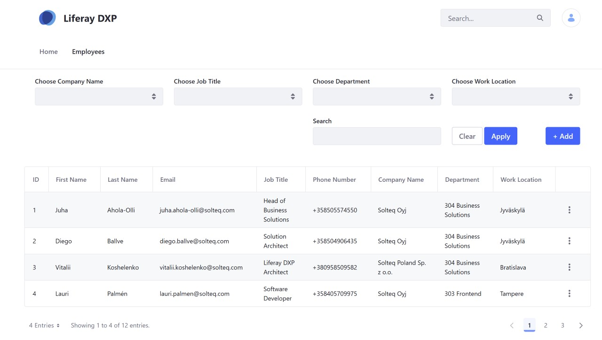
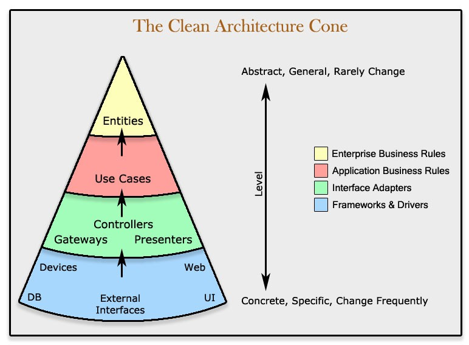

# Solteq Liferay Training

### Overview

This is a repository for a Liferay Training Session in Jyväskylä, Finland on October 21, 2025.

### Branches

|                                                                       Branch | Description                                  |
|-----------------------------------------------------------------------------:|----------------------------------------------|
| [master](https://github.com/vitalii-koshelenko/liferay-training/tree/master) | Main branch with basic setup and assignments |
|  [final](https://github.com/vitalii-koshelenko/liferay-training/tree/final)  | Final version                                |

### Training Project Overview

In the scope of this training session we'll implement an Employee Registry application: a Liferay-based solution for employees management - with search and filtering capabilities, configuration and registration option. 



The application should be able to work with different repositories (InMemory, Database, Elasticsearch, Liferay Objects) for querying and storing data, while using generic interfaces for data access.

### Liferay Features

|              Feature | Description / Usage                                        |
|---------------------:|------------------------------------------------------------|
|                 OSGi | Application is leveraging dynamic OSGi modules             |
|         MVC Portlets | Application UI is implemented as Liferay widget            |
|           Panel Apps | For administrative widget in a Control Panel               |
|      Service Builder | Service Builder is used for database implementation        |
|        Upgrade Steps | For modifying database schema, and also for loading data   |
|           Validation | Validation and error handling                              |
|               Search | Model indexing and searching                               |
|              Objects | Extending Liferay model with System Objects                |
|        Configuration | Custom configuration in System Settings                    |
|       Scheduled Jobs | Custom Dispatch Task Executor                              |
|         Localization | Global Resource Bundle for translations                    |
|        JSP Overrides | Module JSP Override for registration UI customization      |
| MVCCommand Overrides | For customizing business-logic during registration process |
| Context Contributors | To provide custom services for the template context        |
|            Fragments | Custom fragment leveraging contributor-provided service    |

### Tools Overview

|                  Feature | Description / Usage                                                                          |
|-------------------------:|----------------------------------------------------------------------------------------------|
|                Blade CLI | Command-line tool, used for OSGi modules scaffolding                                         |
| Liferay Gradle Workspace | Project layout and build tools, defines the project structure and provides the build scripts |
|                   Docker | For Database, Liferay is run as a standalone bundle                                          |
|         Felix Gogo Shell | Command-line tool, for inspecting OSGi bundles                                               |
|            Intellij IDEA | IDE                                                                                          |
| Groovy Scripting Console | For checking OSGi services before UI is implemented                                          |
|                  Postman | For sending requests to Elasticsearch                                                        |


### Architecture Overview

In this workshop we'll follow the Clean Architecture approach:

|                                          Architecture Overview | Architecture Layers                                             |
|---------------------------------------------------------------:|-----------------------------------------------------------------|
|  |   |

The application should be implemented according to the following principles:

|               Principle | Description                                                  |
|------------------------:|--------------------------------------------------------------|
|   Model-Driven Approach | Entity in the middle, everything starts from the model       |
|  Separation of Concerns | Clean architectural layers with distinct responsibilities    |
|             Abstraction | Program to an Interface, Not an Implementation               |
|               Isolation | Domain logic isolated from Database and UI                   |
| Dynamic Implementations | Implementations are dynamic and can be replaced "on-the-fly" |

### Data Model

The Employee entity has the following fields for storing the employee data:

|         Name | Description                |
|-------------:|----------------------------|
|   employeeId | Unique employee identifier |
|    firstName | First name                 |
|     lastName | Last name                  |
|        email | E-Mail                     |
|     jobTitle | Job title                  |
|  phoneNumber | Phone number               |
|  companyName | Legal company name         |
|   department | Department                 |
| workLocation | City                       |

## Code Conventions and Modules Structure

### Code Conventions

|                Name | Description                     |
|--------------------:|---------------------------------|
|         Bundle-Name | Solteq Liferay Training XXX     |
| Bundle-SymbolicName | com.solteq.liferay.training.xxx |
|        Module Name  | stq-xxx                         |

### Modules Structure

```markdown
modules
└── stq-employees
    ├── stq-employees-api
    ├── stq-employees-impl
    ├── 
    └── stq-employees-web 
```

And now let's get [started](workshop/01-osgi/README.md)! 

###### © [Vitaliy Koshelenko](https://www.linkedin.com/in/vitaliy-koshelenko) 2025 | Solteq | Jyväskylä, Finland